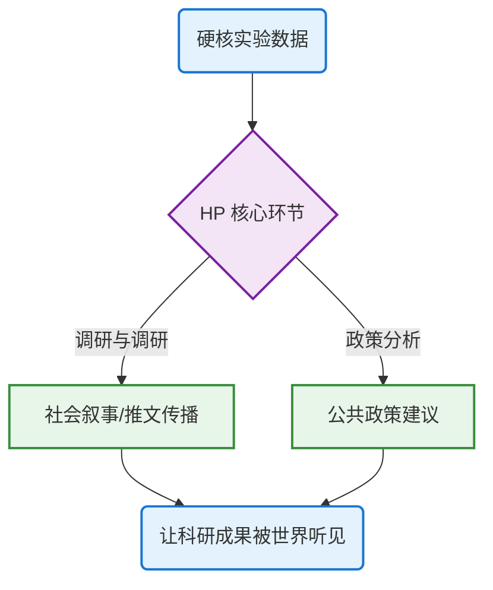

# <p align="center" style="color: #2E7D32; font-family: 'Microsoft YaHei';">🌿 自我介绍</p>
<div style="padding: 20px; background-color: #f1f8e9; border-radius: 15px; border: 1px solid #c5e1a5; line-height: 1.8;">
<p><strong>基本信息：</strong></p>
<ul>
<li><strong>姓名：</strong> 王雨丹 (Wang Yudan)</li>
<li><strong>学号：</strong> 23301020099</li>
<li><strong>专业：</strong> 公共卫生学院 23级预防医学</li>
</ul>
</div>

## 一、自我评价
就像iGEM官网中的一句介绍
> Today,these companiesare at the forefront of developing biological solutions topreserve the environment and improve the lives of peopleworldwide.
我始终认为，一个好的iGEM项目需要两条腿走路：一条是完美的实验数据，另一条是动人的社会叙事。一个真正卓越的 iGEM 项目，不能只有完美的实验数据作为骨架，更需要动人的社会叙事注入灵魂。我申请加入队伍，正是为了填补这至关重要的一环——我或许不是那个在显微镜下待得最久、最擅长分子克隆的人，但我自信能成为那个让枯燥数据“掷地有声”、让科研成果被世界听见的传播者与组织者。我希望能用自己在宣传调研上的敏锐触角和外联统筹上的实战经验，把我们的项目包装得既专业又引人入胜，为硬核的科学带来不一样的温度与色彩。
---

## 二、技能列表与实践经验
**技能列表**
<div style="margin: 20px 0; padding: 15px; background-color: #f8f9fa; border-radius: 8px; border-left: 4px solid #74b9ff;">

|维度|内容|
|:---|:---:|
|编程|熟练使用 Python 进行数据分析与可视化|
|科研素养|德隆项目即将结项，在课题组学习|
|社会实践|有相伯项目，累计 200+ 小时志愿服务|
</div>

**社会实践**
1. <strong>建设老年人助浴平台社会实践</strong> 项目成员（2023.09-2023.12） <span style="color: #2e7d32; font-weight: bold;">项目获评A级</span> </li> 
2. <strong>枝叶关情，以爱驱散黑暗；触见光明、共塑融合未来社会实践</strong> 负责人 （2024.03-2024.09） <span style="color: #2e7d32; font-weight: bold;">项目获评A级</span> </li> 
3. <strong>“三下乡”暑期社会实践</strong> 项目成员（2024.07） <span style="color: #2e7d32; font-weight: bold;">项目获评A级</span> </li> 
4. <strong>七色堇罕见病科普与罕见病陪伴公共政策研究社会实践</strong>（2024.09-2025.01） <span style="color: #2e7d32; font-weight: bold;">负责人</span> </li> 
6. 复旦大学<strong>“砺行计划”</strong>赴普洱市卫生健康委员会进行为期一月的实习实践（2025.7-2025.8）<br>

**志愿活动**
总志愿时长超200h，主要参与过的志愿活动如下：
</p> <ul style="margin: 0; padding-left: 20px; color: #546e7a;"> <li>2025上海论坛志愿者</li> 
<li>2024上海半程马拉松志愿者</li>
 <li>2025校友返校日策划及台湾校友接待</li> 
 <li>复旦大学第九届乐跑赛裁判</li> 
 <li>2023年复旦管理学论坛志愿者</li>
  </ul> </div>
<br>

**科研经历**：我已加入公共卫生学院营养与食品卫生学教研室薛琨老师课题组，并作为第一负责人主持了“德隆二期”及参与了FDUROP“相伯项目”等科研项目。

* 德隆项目时间路线图
 
（图片在[tinypng网站](https://tinypng.com/)压缩，通过[第三方图床网站](https://picui.cn)上传）

**数学建模**：我熟练掌握 Python 编程，并获得过光华杯和卓越杯三等奖，具备良好的逻辑思维和数据处理能力。
* python代码示例（此代码用于问卷中营养知识赋分）
```python
import pandas as pd
import numpy as np

df = pd.read_excel("合并且筛选清洗后数据.xlsx",sheet_name="sheet2")

# --- 维度一：健康饮食态度 (D5A-D5K) ---
positive_questions_d5 = ['D5A', 'D5B', 'D5C', 'D5D', 'D5G', 'D5H', 'D5J', 'D5K']
negative_questions_d5 = ['D5E', 'D5F', 'D5I']

# 计算得分：正向题直接计分，反向题反向计分(4-x)
df['attitude_diet_positive'] = df[positive_questions_d5].sum(axis=1)
df['attitude_diet_negative'] = df[negative_questions_d5].apply(lambda x: (4 - x).sum(), axis=1)
df['attitude_diet_total'] = df['attitude_diet_positive'] + df['attitude_diet_negative']

# --- 维度二：科学减肥态度 (D19A-D19E) ---
positive_questions_d19 = ['D19A', 'D19B', 'D19C']
negative_questions_d19 = ['D19D', 'D19E']

df['attitude_weight_positive'] = df[positive_questions_d19].sum(axis=1)
df['attitude_weight_negative'] = df[negative_questions_d19].apply(lambda x: (4 - x).sum(), axis=1)
df['attitude_weight_total'] = df['attitude_weight_positive'] + df['attitude_weight_negative']

# --- 维度三：肥胖社会态度 (D2001-D2028) ---
positive_stereotypes = ['D2001', 'D2002', 'D2007', 'D2008', 'D2009', 'D2017', 'D2018', 'D2019', 'D2020', 'D2023', 'D2025', 'D2028'] 
negative_stereotypes = ['D2003', 'D2004', 'D2005', 'D2006', 'D2010', 'D2011', 'D2012', 'D2013', 'D2014', 'D2015', 'D2016', 'D2021', 'D2022', 'D2024', 'D2026', 'D2027'] 
all_d20_questions = [f'D20{i:02d}' for i in range(1, 29)]

df['attitude_stereotype_positive'] = df[positive_stereotypes].sum(axis=1)
df['attitude_stereotype_negative'] = df[negative_stereotypes].apply(lambda x: (4 - x).sum(), axis=1)
df['attitude_stereotype_total'] = df['attitude_stereotype_positive'] + df['attitude_stereotype_negative']

# --- 维度四：自我体形态度 ---
# D21 计分映射
d21_score_map = {1: 1, 2: 2, 3: 3, 4: 2, 5: 1}
df['attitude_self_body_D21'] = df['D21'].map(d21_score_map)

# D22 计分映射
df['attitude_self_body_D22'] = (df['D22'] == 1).astype(int) 

# D23与D24的差距 (反向计分，差距越小得分越高)
df['attitude_self_body_discrepancy'] = 4 - (df['D24'] - df['D23']).abs()
# 处理可能的负值（当差距很大时）
df['attitude_self_body_discrepancy'] = df['attitude_self_body_discrepancy'].clip(lower=0)

df['attitude_self_body_total'] = df['attitude_self_body_D21'] + df['attitude_self_body_D22'] + df['attitude_self_body_discrepancy']

cols_to_show = ['ID', 'attitude_diet_total', 'attitude_weight_total', 'attitude_stereotype_total', 'attitude_self_body_total']
print(df[cols_to_show].head())

# 保存结果
df.to_excel("包含态度评分的问卷数据.xlsx", index=False)
```
---
## 三、我理解的HP工作流程


---
## 四、GitHub项目展示
[我的github网站](https://github.com/yudannnw/iGEM)